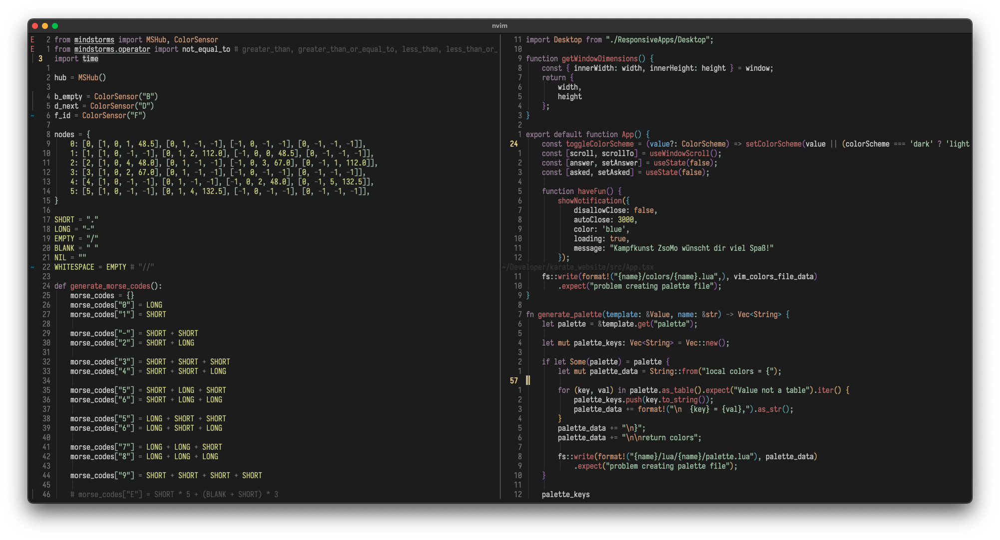

# My Vidid

My Vivid is a color scheme for Neovim. It has no background color, so it is transparent and takes the color of the terminal.

## Usage 

### Packer

```
use "RaphaeleL/my_vivid"
```

### Lazy 

```
{
    "RaphaeleL/my_vivid",
    lazy = true,
}
```

## Showcase



